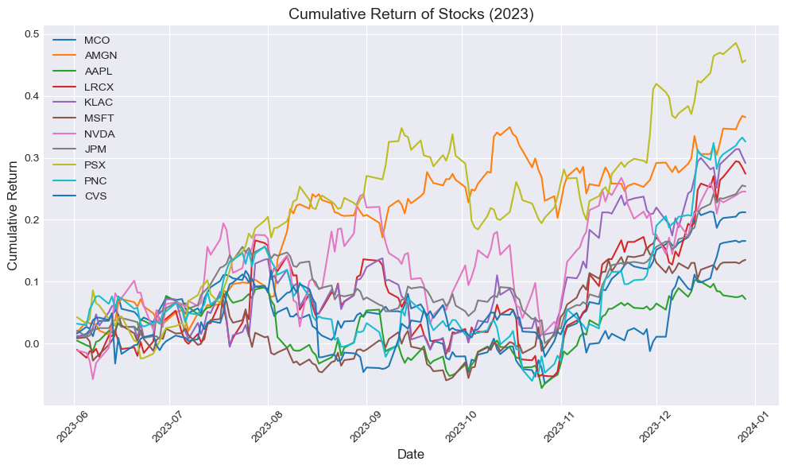
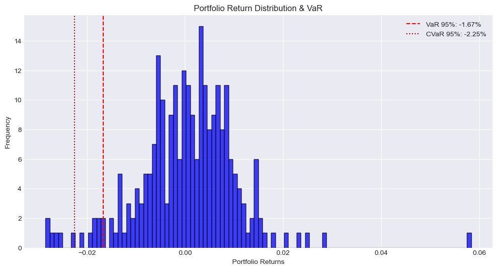

# Project Overview:
This project focuses on constructing an optimized equity portfolio and assessing its risk using Value at Risk (VaR) and Conditional Value at Risk (CVaR). It employs historical data and Monte Carlo simulations to evaluate portfolio performance under normal and extreme market conditions. The findings provide insights into risk management strategies, aligning with Basel regulatory considerations.

# Table of Contents
1. [Introduction](#introduction)  
2. [Data Acquisition](#data-acquisition)  
3. [Portfolio Construction](#portfolio-construction)  
4. [Equity Portfolio Risk Measurement](#equity-portfolio-risk-measurement)  
5. [Basel Considerations for Portfolio VaR and CVaR Measurement](#Basel-Considerations-for-Portfolio-VaR-and-CVaR-Measurement)  
6. [Historical VaR and CVaR](#historical-var-and-cvar)  
7. [Monte Carlo VaR and Expected Shortfall](#monte-carlo-var-and-expected-shortfall)  
8. [Analysis Report](#analysis-report)  
9. [Conclusion](#conclusion)  

## <a id="introduction"></a> Introduction  

In modern financial markets, managing portfolio risk is essential for optimizing returns while complying with regulations. This project aims to build an equity portfolio using historical stock data, measure its risk using Value at Risk (VaR) and Conditional Value at Risk (CVaR), and compare different risk measurement methods, including historical and Monte Carlo simulations.

We start by gathering historical closing price data for a variety of stocks across key industries using the yfinance library. This dataset covers June 1, 2023, to December 31, 2024, providing a solid timeframe for portfolio construction and evaluation. The portfolio is then optimized using Monte Carlo simulations to generate and assess numerous randomly weighted portfolios, identifying the best risk-adjusted allocation.

The heart of this study is risk measurement. We calculate VaR and CVaR with historical and Monte Carlo methods to understand potential losses in normal and extreme market conditions. We also consider regulatory guidelines under Basel frameworks and their impact on risk management. Through stress testing and sensitivity analysis, we examine how market shocks affect portfolio performance, revealing potential tail risks.

This study not only showcases quantitative risk assessment techniques but also offers practical insights for portfolio managers. By using statistical methods and adhering to regulatory standards, the project highlights the importance of diversification and hedging strategies in managing financial uncertainty effectively.


```python
# Import and filter warnings
import warnings
warnings.filterwarnings("ignore")

# Import required libraries
import numpy as np
import pandas as pd
import yfinance as yf
import time
from scipy import stats

# For visualisation
import seaborn as sns
import matplotlib.pyplot as plt
from matplotlib.gridspec import GridSpec
plt.style.use('seaborn-v0_8-darkgrid')
%matplotlib inline
```

## <a id="data-acquisition"></a> Data Acquisition  
Fetching the historical closing price data for a list of equity tickers using the yfinance library. The code iterates through a list of stock tickers, which includes well-known companies across various sectors:

Financial Services: Moody's Corporation (MCO), JPMorgan Chase & Co. (JPM), PNC Financial Services (PNC)
Healthcare: Amgen Inc. (AMGN), CVS Health Corporation (CVS)
Technology: Apple Inc. (AAPL), Microsoft Corporation (MSFT), NVIDIA Corporation (NVDA), Lam Research Corporation (LRCX), KLA Corporation (KLAC)
Energy: Phillips 66 (PSX)

The historical price data for these stocks is retrieved from June 1, 2023, to December 31, 2024, with each stock's closing prices recorded. We then split the data into two sets: one for portfolio construction using Q3 and Q4 of 2023, and the other for performance and risk measurement throughout 2024.


```python
# List of Equity tickers
tickers = ['MCO', 'AMGN', 'AAPL', 'LRCX', 'KLAC', 'MSFT','NVDA', 
            'JPM', 'PSX', 'PNC', 'CVS']

# Dictionary to store close price data
close_data = {}

# Fetch data for each Equity
for ticker in tickers:
    try:
        equity = yf.Ticker(ticker)
        
        # Fetch historical data (2023-2024)
        historical_data = equity.history(start="2023-06-01", end="2024-12-31")
        
        if historical_data.empty:
            print(f"Warning: No historical data found for {ticker}.")
            continue
        
        # Store close prices
        close_data[ticker] = historical_data['Close']
        
    except Exception as e:
        print(f"Error fetching data for {ticker}: {e}")
    
    # Delay to avoid hitting API rate limits
    time.sleep(1)

# Convert dictionary to DataFrame
price_df = pd.DataFrame(close_data)

# Save the DataFrame to CSV
price_df.to_csv("Price_df.csv", index=True)

# Print DataFrame for verification
print("\nPrice Data (2023-2024):")
print(price_df.head())  # Display the first few rows
```

    
    Price Data (2023-2024):
                                      MCO        AMGN        AAPL       LRCX  \
    Date                                                                       
    2023-06-01 00:00:00-04:00  319.686035  204.704407  178.734863  58.660248   
    2023-06-02 00:00:00-04:00  322.965118  208.334778  179.588409  58.074459   
    2023-06-05 00:00:00-04:00  324.752869  211.974701  178.228745  57.311707   
    2023-06-06 00:00:00-04:00  326.619629  211.344147  177.861511  57.935349   
    2023-06-07 00:00:00-04:00  323.449158  211.372818  176.481979  57.800964   
    
                                     KLAC        MSFT       NVDA         JPM  \
    Date                                                                       
    2023-06-01 00:00:00-04:00  446.096954  328.746796  39.747845  131.796600   
    2023-06-02 00:00:00-04:00  451.548401  331.534271  39.305092  134.565094   
    2023-06-05 00:00:00-04:00  451.538513  332.068054  39.149178  133.243088   
    2023-06-06 00:00:00-04:00  454.446594  329.834106  38.632469  133.482590   
    2023-06-07 00:00:00-04:00  457.167389  319.652802  37.457993  134.775818   
    
                                     PSX         PNC        CVS  
    Date                                                         
    2023-06-01 00:00:00-04:00  88.452370  111.461334  64.202560  
    2023-06-02 00:00:00-04:00  92.235710  115.035851  65.237198  
    2023-06-05 00:00:00-04:00  91.275612  114.756592  65.936256  
    2023-06-06 00:00:00-04:00  92.036079  117.642265  65.721878  
    2023-06-07 00:00:00-04:00  96.057091  118.740662  66.626022  
    


```python
# Calculate daily percentage changes for all stocks
stock_returns = price_df.pct_change().dropna()

round(stock_returns.head(),2)
```


<div>
<style scoped>
    .dataframe tbody tr th:only-of-type {
        vertical-align: middle;
    }

    .dataframe tbody tr th {
        vertical-align: top;
    }

    .dataframe thead th {
        text-align: right;
    }
</style>
<table border="1" class="dataframe">
  <thead>
    <tr style="text-align: right;">
      <th></th>
      <th>MCO</th>
      <th>AMGN</th>
      <th>AAPL</th>
      <th>LRCX</th>
      <th>KLAC</th>
      <th>MSFT</th>
      <th>NVDA</th>
      <th>JPM</th>
      <th>PSX</th>
      <th>PNC</th>
      <th>CVS</th>
    </tr>
    <tr>
      <th>Date</th>
      <th></th>
      <th></th>
      <th></th>
      <th></th>
      <th></th>
      <th></th>
      <th></th>
      <th></th>
      <th></th>
      <th></th>
      <th></th>
    </tr>
  </thead>
  <tbody>
    <tr>
      <th>2023-06-02 00:00:00-04:00</th>
      <td>0.01</td>
      <td>0.02</td>
      <td>0.00</td>
      <td>-0.01</td>
      <td>0.01</td>
      <td>0.01</td>
      <td>-0.01</td>
      <td>0.02</td>
      <td>0.04</td>
      <td>0.03</td>
      <td>0.02</td>
    </tr>
    <tr>
      <th>2023-06-05 00:00:00-04:00</th>
      <td>0.01</td>
      <td>0.02</td>
      <td>-0.01</td>
      <td>-0.01</td>
      <td>-0.00</td>
      <td>0.00</td>
      <td>-0.00</td>
      <td>-0.01</td>
      <td>-0.01</td>
      <td>-0.00</td>
      <td>0.01</td>
    </tr>
    <tr>
      <th>2023-06-06 00:00:00-04:00</th>
      <td>0.01</td>
      <td>-0.00</td>
      <td>-0.00</td>
      <td>0.01</td>
      <td>0.01</td>
      <td>-0.01</td>
      <td>-0.01</td>
      <td>0.00</td>
      <td>0.01</td>
      <td>0.03</td>
      <td>-0.00</td>
    </tr>
    <tr>
      <th>2023-06-07 00:00:00-04:00</th>
      <td>-0.01</td>
      <td>0.00</td>
      <td>-0.01</td>
      <td>-0.00</td>
      <td>0.01</td>
      <td>-0.03</td>
      <td>-0.03</td>
      <td>0.01</td>
      <td>0.04</td>
      <td>0.01</td>
      <td>0.01</td>
    </tr>
    <tr>
      <th>2023-06-08 00:00:00-04:00</th>
      <td>0.02</td>
      <td>-0.00</td>
      <td>0.02</td>
      <td>0.01</td>
      <td>0.02</td>
      <td>0.01</td>
      <td>0.03</td>
      <td>0.00</td>
      <td>-0.02</td>
      <td>0.01</td>
      <td>0.00</td>
    </tr>
  </tbody>
</table>
</div>


### Split data 
We will utilize the price data from Q3 and Q4 of 2023 for portfolio allocation and subsequently calculate the risk measurement for the entire year of 2024.


```python
# We split the data to avoid look ahead bias
returns_till_2023 = stock_returns[:"2023"]
returns_from_2024 = stock_returns["2024":]

prices_till_2023 = price_df[:"2023"]
prices_from_2024 = price_df["2024":]

round(prices_till_2023.tail(),2)
```


<div>
<style scoped>
    .dataframe tbody tr th:only-of-type {
        vertical-align: middle;
    }

    .dataframe tbody tr th {
        vertical-align: top;
    }

    .dataframe thead th {
        text-align: right;
    }
</style>
<table border="1" class="dataframe">
  <thead>
    <tr style="text-align: right;">
      <th></th>
      <th>MCO</th>
      <th>AMGN</th>
      <th>AAPL</th>
      <th>LRCX</th>
      <th>KLAC</th>
      <th>MSFT</th>
      <th>NVDA</th>
      <th>JPM</th>
      <th>PSX</th>
      <th>PNC</th>
      <th>CVS</th>
    </tr>
    <tr>
      <th>Date</th>
      <th></th>
      <th></th>
      <th></th>
      <th></th>
      <th></th>
      <th></th>
      <th></th>
      <th></th>
      <th></th>
      <th></th>
      <th></th>
    </tr>
  </thead>
  <tbody>
    <tr>
      <th>2023-12-22 00:00:00-05:00</th>
      <td>384.51</td>
      <td>275.83</td>
      <td>192.66</td>
      <td>74.44</td>
      <td>577.52</td>
      <td>371.80</td>
      <td>48.82</td>
      <td>162.66</td>
      <td>129.81</td>
      <td>145.55</td>
      <td>74.65</td>
    </tr>
    <tr>
      <th>2023-12-26 00:00:00-05:00</th>
      <td>385.25</td>
      <td>275.57</td>
      <td>192.11</td>
      <td>75.94</td>
      <td>586.16</td>
      <td>371.88</td>
      <td>49.27</td>
      <td>163.62</td>
      <td>131.42</td>
      <td>147.11</td>
      <td>74.88</td>
    </tr>
    <tr>
      <th>2023-12-27 00:00:00-05:00</th>
      <td>387.12</td>
      <td>278.13</td>
      <td>192.21</td>
      <td>75.87</td>
      <td>586.26</td>
      <td>371.29</td>
      <td>49.40</td>
      <td>164.60</td>
      <td>130.43</td>
      <td>147.97</td>
      <td>74.71</td>
    </tr>
    <tr>
      <th>2023-12-28 00:00:00-05:00</th>
      <td>387.54</td>
      <td>280.00</td>
      <td>192.64</td>
      <td>75.37</td>
      <td>581.10</td>
      <td>372.49</td>
      <td>49.51</td>
      <td>165.47</td>
      <td>128.63</td>
      <td>148.57</td>
      <td>74.85</td>
    </tr>
    <tr>
      <th>2023-12-29 00:00:00-05:00</th>
      <td>387.47</td>
      <td>279.57</td>
      <td>191.59</td>
      <td>74.76</td>
      <td>576.18</td>
      <td>373.25</td>
      <td>49.51</td>
      <td>165.28</td>
      <td>128.92</td>
      <td>147.83</td>
      <td>74.84</td>
    </tr>
  </tbody>
</table>
</div>


The returns are calculated as percentage changes, which ensures they are scale-independent.


```python
# Calculate cumulative returns by taking the cumulative product of (1 + daily return)
cumulative_returns = (1 + returns_till_2023).cumprod() - 1

# Plot each stock's cumulative return with a different color
plt.figure(figsize=(10,6))

for stock in cumulative_returns.columns:
    plt.plot(cumulative_returns.index, cumulative_returns[stock], label=stock)

# Add title and labels
plt.title('Cumulative Return of Stocks (2023)', fontsize=14)
plt.xlabel('Date', fontsize=12)
plt.ylabel('Cumulative Return', fontsize=12)
plt.legend(loc='upper left', fontsize=10)
plt.xticks(rotation=45)
plt.grid(True)

# Display the plot
plt.tight_layout()
plt.show()
```


    

    


## <a id="portfolio-construction"></a> Portfolio Construction  

We constructed randomly weighted portfolios and evaluated their performance using key financial metrics through Monte Carlo simulation for portfolio optimization. This approach involves generating numerous portfolios with randomly assigned weights and analyzing their risk-return characteristics. We employ Monte Carlo-based optimization to explore possible portfolio allocations and identify the one with the best risk-adjusted return. Techniques used include Monte Carlo Simulation for generating portfolio weight combinations, Mean-Variance Optimization (MVO) for balancing risk and return, and Sharpe-like Ratio Maximization for selecting the top-performing portfolio. Despite being computationally simple, this method provides valuable insights into portfolio diversification and the risk-return trade-off.

Generating Random Portfolios
We created 2,000 portfolios $ N = 2000 $ by assigning random weights $w_i$ to each stock in the portfolio, ensuring that they sum to 1:  

$$
\sum_{i=1}^{n} w_i = 1, \quad w_i \geq 0
$$  

where $n$ is the number of stocks. These weights determine each portfolio's composition and influence its expected return and risk. For each randomly generated portfolio, we computed its expected return $R_p$, standard deviation $ \sigma_p $, and return-to-risk ratio $ RR $ using the following formulas:  

Portfolio Return $R_p$:  

$$
R_p = \sum_{i=1}^{n} w_i R_i
$$

where $R_i$ represents the daily return of stock $i$.  

Portfolio Standard Deviation (Risk) $\sigma_p$:  

$$
\sigma_p = \sqrt{w^T \Sigma w}
$$

where $ \Sigma $ is the covariance matrix of stock returns. Since we used historical daily returns, we estimated risk based on past volatility.  

Return-to-Risk Ratio (Sharpe-like ratio, without risk-free rate):  

$$
RR = \frac{R_p}{\sigma_p} \times \sqrt{12}
$$

This ratio is similar to the Sharpe ratio but does not subtract a risk-free rate, as our focus is purely on risk-adjusted returns.  After calculating these metrics for all portfolios, we identified the optimal portfolio as the one maximizing the return-to-risk ratio $\max(RR)$ to find the efficient frontier. 


```python
def get_portfolio_metrics(portfolio, daily_returns, num_stocks):
    # Calculate portfolio performance metrics
    p_returns = (portfolio[:num_stocks].to_numpy() * daily_returns).sum(axis=1)
    p_std = np.std(p_returns)
    rr = (p_returns.mean()/p_std) * np.sqrt(12)
    
    #Define a dataframe to store weights and portfolio performance metrics
    portfolio2 = pd.DataFrame(columns =portfolio.index.tolist())
    
    # Store the weights and portfolio performance metrics
    portfolio2.loc[len(portfolio)] = np.append(portfolio[:num_stocks].to_numpy(), [p_returns.mean(), p_std, rr])
    
    return portfolio2.loc[len(portfolio)]
```


```python
# Create an empty dataframe to store elements of each portfolio
portfolio = pd.DataFrame(columns =prices_till_2023.columns.tolist())

# Daily returns of the stocks
dayli_returns = prices_till_2023.pct_change().dropna()

# Calculate the return and standard deviation for each portfolio
num_portf = 2000
num_stocks = len(prices_till_2023.columns)

for i in range(num_portf):
    # Generate random numbers
    weights = np.random.random_sample(num_stocks)

    # Divide weights with the sum of weights
    weights = weights / sum(weights)
    
    # Store weights in the dataframe
    portfolio.loc[i] = np.append(weights,[])

# Add columns for calculating portfolio performance metrics
portfolio[["Portfolio Return", "Portfolio Std", "Return to Risk"]] = 0

# Call the function built for calculating performance metrics by using apply method
portfolio = portfolio.apply(get_portfolio_metrics, axis=1, args = (dayli_returns, num_stocks,))

# Find the optimal portfolio
portfolio = portfolio.astype('float64')
optimal_portfolio = portfolio.iloc[portfolio["Return to Risk"].idxmax()]

round(portfolio.tail(),4)
```


<div>
<style scoped>
    .dataframe tbody tr th:only-of-type {
        vertical-align: middle;
    }

    .dataframe tbody tr th {
        vertical-align: top;
    }

    .dataframe thead th {
        text-align: right;
    }
</style>
<table border="1" class="dataframe">
  <thead>
    <tr style="text-align: right;">
      <th></th>
      <th>MCO</th>
      <th>AMGN</th>
      <th>AAPL</th>
      <th>LRCX</th>
      <th>KLAC</th>
      <th>MSFT</th>
      <th>NVDA</th>
      <th>JPM</th>
      <th>PSX</th>
      <th>PNC</th>
      <th>CVS</th>
      <th>Portfolio Return</th>
      <th>Portfolio Std</th>
      <th>Return to Risk</th>
    </tr>
  </thead>
  <tbody>
    <tr>
      <th>1995</th>
      <td>0.0889</td>
      <td>0.1359</td>
      <td>0.0801</td>
      <td>0.0006</td>
      <td>0.0154</td>
      <td>0.1656</td>
      <td>0.1279</td>
      <td>0.0959</td>
      <td>0.0853</td>
      <td>0.1333</td>
      <td>0.0710</td>
      <td>0.0016</td>
      <td>0.0084</td>
      <td>0.6731</td>
    </tr>
    <tr>
      <th>1996</th>
      <td>0.1480</td>
      <td>0.0946</td>
      <td>0.0783</td>
      <td>0.0578</td>
      <td>0.1294</td>
      <td>0.0625</td>
      <td>0.0478</td>
      <td>0.0940</td>
      <td>0.0402</td>
      <td>0.1052</td>
      <td>0.1423</td>
      <td>0.0016</td>
      <td>0.0086</td>
      <td>0.6477</td>
    </tr>
    <tr>
      <th>1997</th>
      <td>0.0639</td>
      <td>0.0802</td>
      <td>0.2183</td>
      <td>0.1578</td>
      <td>0.0060</td>
      <td>0.0937</td>
      <td>0.0011</td>
      <td>0.2065</td>
      <td>0.1352</td>
      <td>0.0215</td>
      <td>0.0158</td>
      <td>0.0015</td>
      <td>0.0080</td>
      <td>0.6704</td>
    </tr>
    <tr>
      <th>1998</th>
      <td>0.1799</td>
      <td>0.0381</td>
      <td>0.1243</td>
      <td>0.1319</td>
      <td>0.0864</td>
      <td>0.0447</td>
      <td>0.1771</td>
      <td>0.0393</td>
      <td>0.0903</td>
      <td>0.0783</td>
      <td>0.0098</td>
      <td>0.0017</td>
      <td>0.0104</td>
      <td>0.5480</td>
    </tr>
    <tr>
      <th>1999</th>
      <td>0.1252</td>
      <td>0.0734</td>
      <td>0.0420</td>
      <td>0.0392</td>
      <td>0.0672</td>
      <td>0.1566</td>
      <td>0.1170</td>
      <td>0.0098</td>
      <td>0.0941</td>
      <td>0.1567</td>
      <td>0.1189</td>
      <td>0.0017</td>
      <td>0.0088</td>
      <td>0.6506</td>
    </tr>
  </tbody>
</table>
</div>


```python
import matplotlib.pyplot as plt

# Create a figure with 1 row and 2 columns
fig, axes = plt.subplots(nrows=1, ncols=2, figsize=(15, 6))

# First Plot: Efficient Frontier with Optimal Portfolio
axes[0].scatter(portfolio["Portfolio Std"], portfolio["Portfolio Return"], label="Portfolios")
axes[0].scatter(optimal_portfolio["Portfolio Std"], optimal_portfolio["Portfolio Return"], 
                color='red', s=50, label="Optimal Portfolio")
axes[0].set_xlabel('Volatility')
axes[0].set_ylabel('Return')
axes[0].set_title('Efficient Frontier')
axes[0].legend()

# Second Plot: Portfolio Weight Allocation
optimal_portfolio[prices_till_2023.columns].mul(100).sort_values(ascending=False).plot.bar(
    ax=axes[1], title="Portfolio Weight Allocation", rot=25
)
axes[1].set_ylabel("Weight (%)")

# Adjust layout and show the grid plots
plt.tight_layout()
plt.show()

# Print optimal portfolio details
print("Optimal Portfolio:\n", optimal_portfolio)

```


    

    


    Optimal Portfolio:
     MCO                 0.112175
    AMGN                0.160132
    AAPL                0.007747
    LRCX                0.011625
    KLAC                0.037591
    MSFT                0.001045
    NVDA                0.070919
    JPM                 0.217107
    PSX                 0.194249
    PNC                 0.053956
    CVS                 0.133454
    Portfolio Return    0.001880
    Portfolio Std       0.007913
    Return to Risk      0.823008
    Name: 37, dtype: float64
    


```python
def portfolio_performance(returns, asset_weight):
    # Portfolio returns
    portfolio_returns = (asset_weight * returns).sum(axis=1)

    # Portfolio returns
    portfolio_cum = (1 + portfolio_returns).cumprod()
    total_return = portfolio_cum.iloc[-1] / portfolio_cum.iloc[0] - 1
    print("Portfolio return : ", round(100 * total_return, 2), "%")

    # Plotting portfolio returns
    plt.figure(figsize=(10, 7))
    plt.plot(portfolio_cum)
    plt.title("Portfolio Return Over Time")
    plt.xlabel("Year-Month")
    plt.ylabel("Cumulative Returns")
    plt.tick_params(axis="x", rotation=45)
    plt.show()

    # Annualised performance
    annualised_performance = (
        (portfolio_cum.iloc[-1] / portfolio_cum.iloc[0])
        ** (12 / len(portfolio_returns))
        - 1
    ) * 100

    # Drawdown calculations
    # Calculate the running maximum
    running_max = np.maximum.accumulate(portfolio_cum.dropna())

    # Ensure the value never drops below 1
    running_max[running_max < 1] = 1

    # Calculate the percentage drawdown
    running_drawdown = 100 * ((portfolio_cum) / running_max - 1)

    # Calculate the maximum drawdown
    max_drawdown = running_drawdown.min()

    # Calculate the return to max. drawdown ratio
    return_to_MDD_ratio = annualised_performance / max_drawdown

    # Sharpe Ratio
    sharpe = portfolio_returns.mean() / portfolio_returns.std() * np.sqrt(12)

    # Plot max drawdown
    plt.figure(figsize=(10, 7))
    plt.title("Drawdown (%)", fontsize=14)
    plt.plot(running_drawdown, color="red")
    plt.xlabel("Year-month", fontsize=12)
    plt.ylabel("Drawdown (%)", fontsize=12)
    plt.fill_between(running_drawdown.index, running_drawdown.values, color="red")
    plt.show()

    # Store the performance metrics
    performance_metrics = pd.DataFrame(
        {
            "Sharpe ratio": round(sharpe, 2),
            "Annualised returns (CAGR)": round(annualised_performance, 2),
            "Maximum drawdown (MDD)": round(max_drawdown, 2),
            "Return-to-MDD ratio": abs(round(return_to_MDD_ratio, 2)),
        },
        index=["Performance Metrics"],
    )
    return performance_metrics
```


```python
# Portfolio performance metrics 
weights = optimal_portfolio[prices_till_2023.columns]
performance_metrics = portfolio_performance(returns_from_2024, weights)
performance_metrics.rename(
    index={"Performance Metrics": "CLA Performance Metrics"}, inplace=True
)

performance_metrics
```

    Portfolio return :  11.33 %
    


    

    


    

    


<div>
<style scoped>
    .dataframe tbody tr th:only-of-type {
        vertical-align: middle;
    }

    .dataframe tbody tr th {
        vertical-align: top;
    }

    .dataframe thead th {
        text-align: right;
    }
</style>
<table border="1" class="dataframe">
  <thead>
    <tr style="text-align: right;">
      <th></th>
      <th>Sharpe ratio</th>
      <th>Annualised returns (CAGR)</th>
      <th>Maximum drawdown (MDD)</th>
      <th>Return-to-MDD ratio</th>
    </tr>
  </thead>
  <tbody>
    <tr>
      <th>CLA Performance Metrics</th>
      <td>0.18</td>
      <td>0.51</td>
      <td>-12.09</td>
      <td>0.04</td>
    </tr>
  </tbody>
</table>
</div>


## <a id="equity-portfolio-risk-measurement"></a> Equity Portfolio Risk Measurement  


### Value at Risk (VaR)

Value at Risk (VaR) is a statistical measure used to quantify the level of financial risk within a portfolio over a specified time frame with a given confidence level, $\alpha$. It represents the worst expected loss under normal market conditions over a set period at a given confidence level. Mathematically, VaR is defined as:

$$ VaR_{\alpha}(X) = -\inf \{ x \in \mathbb{R} \mid F_X(x) > \alpha \} = F_Y^{-1}(1 - \alpha) $$

Here, $X$ represents the portfolio loss, $F_X(x)$ is the cumulative distribution function (CDF) of the losses, and $F_Y^{-1}$ is the inverse of the CDF of the portfolio returns, $Y = -X$.

### Expected Shortfall (CVaR)

Expected Shortfall, also known as Conditional Value at Risk (CVaR), extends the concept of VaR by considering the average of losses that exceed the VaR threshold. It provides a measure of the expected loss severity when losses are beyond the VaR level, giving insight into the tail risk. CVaR at confidence level $\alpha$ is defined as:

$$ CVaR_{\alpha}(X) = E[X \mid X \geq VaR_{\alpha}(X)] $$

This formula calculates the expected value of losses $X$ given that the loss is greater than or equal to the VaR at level $\alpha$.

### Historical VS Monte Carlo Methods for VaR and CVaR

Historical methods use past data but may not predict future market changes accurately. In contrast, Monte Carlo simulations can model future expectations, reflecting current or anticipated market dynamics. They offer flexibility in handling complex dependencies and non-normal distributions, allowing for stress testing under various scenarios. While historical methods are straightforward, they are limited by the data's characteristics. Monte Carlo simulations provide a detailed view of tail risk by simulating extreme events, but their accuracy depends on the model quality. Historical VaR might underestimate or overestimate tail risk based on the stability of the historical period. Monte Carlo methods are computationally intensive, requiring many simulations, while historical methods are simpler and involve basic statistics. This project aims to compare these approaches, showing their application in portfolio risk assessment and discussing when one might be preferred over the other.

#### Subadditivity of VaR

Subadditivity in the context of Value at Risk (VaR) implies that the risk of a portfolio, when considered as a whole, is less than or equal to the sum of the risks of its individual components due to diversification. This is mathematically represented as:

$$ \text{Total VaR} \leq \sum \text{VaRs} $$

This is the reason for diversifying a portfolio. The diversification benefit arises because the correlation between different risk factors or assets in a portfolio is less than or equal to 1, which reduces the overall risk.


- For any number of risk factors, the sum of individual VaRs is greater than or equal to the total systematic VaR:

  $$ \sum (\text{Component VaRs}) \geq \text{Total Systematic VaR} $$

-  Consider for example a portfolio with both small cap and large cap equities. The combined VaR of these assets would be:

  $$ \text{VaR}_{\text{small cap}} + \text{VaR}_{\text{large cap}} \geq \text{VaR}_{\text{total equity}} $$

- For a portfolio with international exposure, combining equity VaR with foreign exchange (FX) risk:

  $$ \text{VaR}_{\text{equity}} + \text{VaR}_{\text{FX}} \geq \text{VaR}_{\text{total systematic}} $$

 These principle highlights why diversification is crucial in reducing portfolio risk, demonstrating that the risk of a diversified portfolio is not merely the sum of its parts.


##### Linear Equity Portfolios

A linear equity portfolio is one where the portfolio return can be expressed as a linear combination of the returns of its constituent stocks.

$$ R_p = \mathbf{w'r} = \sum_{i=1}^{n} w_i R_i $$

where:
- $ \mathbf{w} = (w_1, \ldots, w_n)' $ is the vector of portfolio weights.
- $ \mathbf{r} = (R_1, \ldots, R_n)' $ is the vector of returns on the stocks.

This linear relationship simplifies the calculation of portfolio returns, emphasizing the strategic importance of weight allocation.

---

##### Portfolio Sensitivity to Risk Factors (Beta)

Beta ($\beta$) measures how sensitive a portfolio is to changes in an equity risk factor, calculated as a weighted sum of the betas of individual stocks within the portfolio.

$$ \beta_p = \mathbf{w'\beta} = \sum_{i=1}^{n} w_i \beta_i $$

where:
- $ \beta = (\beta_1, \ldots, \beta_n)' $ represents the betas of each stock.

Knowing a portfolio's beta is essential for predicting how market movements or specific risk factors might impact the portfolio, aiding in risk management.

##### Emperical Beta: 
Estimating beta ($\hat{\beta}$) involves calculating the sensitivity of an equity or portfolio to market movements.
By using Ordinary Least Squares regression to estimate beta. It can also be calculated by the Correlation and Volatility


  $$ \hat{\beta} = \text{Market Correlation} \times \text{Relative Volatility} $$

When dealing with multiple risk factors, betas are typically estimated using multiple regression.Accurate beta estimation is crucial for understanding the risk profile of an investment relative to market fluctuations, which is vital for both risk assessment and strategic investment choices.

If individual beta $\beta_i$ are estimated using regression, and the portfolio's beta is computed as the weighted sum of these estimated betas, then both betas are aligned. However, estimation errors, changing correlations, and non-linearity in returns may cause deviations.

#### Risk Factors in Large Equity Portfolios

Large equity portfolios encompass various financial instruments like shares, ETFs, index funds, and futures, each contributing to different risk exposures.

Types of Risk Factors:

- Market Indices: Exposure to different market segments (e.g., small, medium, large cap stocks).
- Sector-Specific Risks: Such as commodity prices, tech indices, or pharmaceutical indices.
- International Exposure: For international portfolios, consider:
  - Oil prices in domestic currency.
  - Exchange rates for each country ($ \text{Exchange Rate} $).
  - Local large cap stock indices.

Identifying these risk factors is key for a thorough risk assessment in diversified or international investment portfolios.

## <a id="Basel-Considerations-for-Portfolio-VaR-and-CVaR-Measurement"></a>  Basel Considerations for Portfolio VaR and CVaR Measurement

Basel regulations, particularly under Basel II, Basel III, and the Fundamental Review of the Trading Book (FRTB), outline several key requirements for risk measurement, including Value at Risk (VaR) and Conditional Value at Risk (CVaR). Below are some important considerations and we try to address them in our analysis:

1. Historical Data Requirements for VaR/CVaR Measurement
Backtesting Requirement: Basel mandates that financial institutions use a minimum of one year (252 trading days) of historical data for VaR calculations.
Recommended Data Range: A range of 3 to 5 years of historical data is advised to capture market fluctuations and long-term trends, improving the accuracy of probability distributions.
Stressed VaR (sVaR): Basel III introduced stressed VaR, requiring financial institutions to compute VaR based on a historical period of severe market stress (e.g., the 2008 financial crisis).

2. VaR Confidence Levels and Holding Periods
Regulatory Standard for Market Risk:
99% Confidence Interval for VaR is required for capital calculations.
A 10-day holding period is mandated for regulatory capital computations.
Trading Desk Risk Management: Many firms also compute 95% confidence level VaR with a one-day holding period for internal risk monitoring.

3. Expected Shortfall (CVaR) and Basel FRTB
Shift from VaR to Expected Shortfall: Basel FRTB (Fundamental Review of the Trading Book) replaced VaR with Expected Shortfall (ES or CVaR) as the primary risk measure.
Why CVaR?: CVaR captures tail risk better than VaR by considering the average losses beyond the VaR threshold, providing a more comprehensive risk assessment.
Confidence Levels for CVaR:
Regulatory capital requirements demand 99% confidence level Expected Shortfall with a 10-day horizon.
Institutions may also calculate 95% confidence level Expected Shortfall for internal monitoring.
4. Stress Testing and Scenario Analysis
Basel regulations require stress testing and scenario analysis to supplement VaR and CVaR calculations.
Stress testing includes:
Historical scenarios (e.g., 2008 financial crisis, dot-com bubble).
Hypothetical shocks (e.g., interest rate hikes, geopolitical risks).
Banks must report their ability to withstand extreme shocks, ensuring they maintain sufficient capital buffers.

## <a id="historical-var-and-cvar"></a> Historical VaR and CVaR  

- VaR Calculation: Historical VaR is computed by ordering historical losses from smallest to largest and finding the loss at the $\alpha$ quantile. 

  $$ VaR_{\alpha, \text{Historical}}(X) = - \text{Quantile}(X, \alpha) $$

- CVaR Calculation: Historical CVaR involves averaging the losses that are greater than or equal to the historical VaR.

  $$ CVaR_{\alpha, \text{Historical}}(X) = \frac{1}{\alpha N} \sum_{i=1}^{N} x_i \mathbf{1}_{\{x_i \geq VaR_{\alpha}(X)\}} $$

  where $N$ is the number of historical observations, and $\mathbf{1}_{\{x_i \geq VaR_{\alpha}(X)\}}$ is an indicator function that is 1 if $x_i$ is greater than or equal to $VaR_{\alpha}(X)$, and 0 otherwise.


```python
# Function to calculate historical VaR & CVaR
def historical_var_cvar(portfolio_returns, alpha=0.05):
    """
    Calculate Historical Value at Risk (VaR) and Conditional Value at Risk (CVaR)
    """
    sorted_returns = portfolio_returns.sort_values()
    var_index = int(alpha * len(sorted_returns))
    VaR = sorted_returns.iloc[var_index]
    CVaR = sorted_returns.iloc[:var_index].mean()
    return VaR, CVaR

# Calculate portfolio returns
portfolio_returns = (returns_from_2024 * weights).sum(axis=1)

# Compute VaR and CVaR at 95% confidence level
VaR_95, CVaR_95 = historical_var_cvar(portfolio_returns, alpha=0.05)
VaR_99, CVaR_99 = historical_var_cvar(portfolio_returns, alpha=0.01)

# Print results
print(f"95% Historical VaR: {round(VaR_95 * 100, 2)}%")
print(f"95% Historical CVaR: {round(CVaR_95 * 100, 2)}%")
print(f"99% Historical VaR: {round(VaR_99 * 100, 2)}%")
print(f"99% Historical CVaR: {round(CVaR_99 * 100, 2)}%")

# Scenario Testing - Simulating a Market Shock
shock_factors = [-0.1, -0.2, -0.3]  # 10%, 20%, 30% market drop
scenario_results = {}

for shock in shock_factors:
    shocked_returns = portfolio_returns + shock  # Apply shock to all returns
    VaR_shock, CVaR_shock = historical_var_cvar(shocked_returns, alpha=0.05)
    scenario_results[f"{int(shock * 100)}% Shock"] = [VaR_shock, CVaR_shock]

scenario_df = pd.DataFrame(scenario_results, index=["VaR 95%", "CVaR 95%"])
print("\nScenario Testing Results:")
print(scenario_df)

# Plot Portfolio Return Distribution & VaR
plt.figure(figsize=(12, 6))
plt.hist(portfolio_returns, bins=100, alpha=0.75, color='blue', edgecolor='black')
plt.axvline(x=VaR_95, color='r', linestyle='dashed', label=f'VaR 95%: {round(VaR_95 * 100, 2)}%')
plt.axvline(x=CVaR_95, color='darkred', linestyle='dotted', label=f'CVaR 95%: {round(CVaR_95 * 100, 2)}%')
plt.title("Portfolio Return Distribution & VaR")
plt.xlabel("Portfolio Returns")
plt.ylabel("Frequency")
plt.legend()
plt.show()

```

    95% Historical VaR: -1.67%
    95% Historical CVaR: -2.25%
    99% Historical VaR: -2.7%
    99% Historical CVaR: -2.81%
    
    Scenario Testing Results:
              -10% Shock  -20% Shock  -30% Shock
    VaR 95%    -0.116729   -0.216729   -0.316729
    CVaR 95%   -0.122511   -0.222511   -0.322511
    


    

    


### Historical VaR and CVar Risk Measurements Analysis Report  
The portfolio shows a 95% VaR of -1.67%, meaning there is a 95% confidence that the portfolio's daily losses will not exceed 1.67%. At a more conservative 99% confidence level, the VaR increases to -2.7%. These relatively modest VaR figures suggest the portfolio has reasonable downside protection under normal market conditions.

The 95% CVaR of -2.25% represents the expected loss exceeding the 95% VaR threshold. The relatively small gap between the 95% VaR (-1.67%) and CVaR (-2.25%) suggests that when losses do exceed VaR, they tend to be contained rather than extreme. Similarly, at the 99% level, the CVaR (-2.81%) is close to the VaR (-2.7%), indicating that tail risks are relatively well-controlled.
Stress Testing Results:
Under stressed scenarios:

- A 10% market shock would lead to a 95% VaR of -11.67% and CVaR of -12.25%
- A 20% market shock increases these to -21.67% (VaR) and -22.25% (CVaR)
- A 30% market shock results in -31.67% (VaR) and -32.25% (CVaR)

The portfolio demonstrates relatively stable risk characteristics under normal conditions, with manageable potential losses at both 95% and 99% confidence levels. The small difference between VaR and CVaR values suggests that extreme tail events, while present, are not dramatically worse than expected losses.Under stress scenarios, the portfolio shows roughly linear loss scaling, indicating predictable behavior during market downturns.

While the portfolio shows good risk control under normal conditions, the stress testing reveals significant potential losses under extreme scenarios. Consider implementing additional hedging strategies if the potential for 20-30% losses exceeds risk tolerance levels. Regular monitoring of market conditions and portfolio rebalancing may help maintain these risk levels.

## <a id="monte-carlo-var-and-expected-shortfall"></a> Monte Carlo VaR and Expected Shortfall  

- VaR Calculation: Monte Carlo VaR involves simulating portfolio returns many times based on assumed distributions of asset returns or risk factors, then finding the $\alpha$ quantile of these simulated losses.

  $$ VaR_{\alpha, \text{Monte Carlo}}(X) = - \text{Quantile}(\text{Simulated Returns}, \alpha) $$

- CVaR Calculation: Monte Carlo CVaR is calculated by taking the average of the simulated losses that exceed the Monte Carlo VaR.

  $$ CVaR_{\alpha, \text{Monte Carlo}}(X) = \frac{1}{M \alpha} \sum_{j=1}^{M} x_j \mathbf{1}_{\{x_j \geq VaR_{\alpha}(X)\}} $$

  where $M$ is the number of Monte Carlo simulations, and $\mathbf{1}_{\{x_j \geq VaR_{\alpha}(X)\}}$ works similarly to the historical method, but with simulated data.


```python
def monte_carlo_var_cvar(returns, weights, confidence_level=0.95, n_simulations=10000, time_horizon=1):
    # Calculate portfolio mean and covariance
    port_returns = returns.dot(weights)
    mean_return = port_returns.mean()
    std_dev = port_returns.std()
    
    # Generate random returns using normal distribution
    np.random.seed(42)
    simulated_returns = np.random.normal(
        mean_return * time_horizon, 
        std_dev * np.sqrt(time_horizon), 
        n_simulations
    )
    
    # Calculate VaR and CVaR
    alpha = 1 - confidence_level
    var = np.percentile(simulated_returns, alpha * 100)
    cvar = simulated_returns[simulated_returns <= var].mean()
    
    # Generate paths for visualization
    n_days = 252  # One year of trading days
    paths = np.zeros((n_simulations, n_days))
    daily_returns = np.random.normal(
        mean_return, 
        std_dev, 
        (n_simulations, n_days)
    )
    paths[:, 0] = 1  # Start with $1
    for t in range(1, n_days):
        paths[:, t] = paths[:, t-1] * (1 + daily_returns[:, t])
    
    return var, cvar, simulated_returns, paths

def calculate_additional_metrics(returns, weights):
    """Calculate additional risk metrics for the portfolio"""
    portfolio_returns = returns.dot(weights)
    
    metrics = {
        'Skewness': stats.skew(portfolio_returns),
        'Kurtosis': stats.kurtosis(portfolio_returns),
        'Jarque-Bera': stats.jarque_bera(portfolio_returns)[0],
        'JB p-value': stats.jarque_bera(portfolio_returns)[1],
        'Daily Volatility': portfolio_returns.std(),
        'Annualized Volatility': portfolio_returns.std() * np.sqrt(252),
        'Semi-Deviation': portfolio_returns[portfolio_returns < 0].std(),
        'Sortino Ratio': (portfolio_returns.mean() / 
                         portfolio_returns[portfolio_returns < 0].std()) * np.sqrt(252)
    }
    
    return pd.Series(metrics)

def historical_stress_test(returns, weights, scenarios):
    portfolio_returns = returns.dot(weights)
    base_value = 1000000  # Assuming 1M initial investment
    
    results = {}
    for scenario, shock in scenarios.items():
        shocked_value = base_value * (1 + shock)
        results[scenario] = shocked_value - base_value
        
    return pd.Series(results)

# Calculate portfolio returns
portfolio_returns = (returns_from_2024 * weights).sum(axis=1)

# Run Monte Carlo simulation
mc_var_95, mc_cvar_95, sim_returns_95, paths_95 = monte_carlo_var_cvar(
    returns_from_2024, 
    weights, 
    confidence_level=0.95
)

mc_var_99, mc_cvar_99, sim_returns_99, paths_99 = monte_carlo_var_cvar(
    returns_from_2024, 
    weights, 
    confidence_level=0.99
)

# Calculate additional metrics
additional_metrics = calculate_additional_metrics(returns_from_2024, weights)

# Create visualization plots
plt.close('all')  # Close any existing plots

# Create figure and subplots
fig = plt.figure(figsize=(15, 20))
gs = GridSpec(4, 2, figure=fig)

# Distribution Comparison 
ax1 = fig.add_subplot(gs[0, :])
sns.histplot(data=portfolio_returns, stat='density', alpha=0.5, color='blue', label='Historical Returns', ax=ax1)
sns.histplot(data=sim_returns_95, stat='density', alpha=0.5, color='red', label='Monte Carlo Returns', ax=ax1)
ax1.axvline(VaR_95, color='blue', linestyle='dashed', label=f'Historical VaR 95%: {round(VaR_95 * 100, 2)}%')
ax1.axvline(mc_var_95, color='red', linestyle='dashed', label=f'Monte Carlo VaR 95%: {round(mc_var_95 * 100, 2)}%')
ax1.set_title('Return Distribution: Historical vs Monte Carlo')
ax1.set_xlabel('Returns')
ax1.set_ylabel('Density')
ax1.legend()

# Monte Carlo Paths 
ax2 = fig.add_subplot(gs[1, :])
sample_paths = paths_95[np.random.choice(paths_95.shape[0], 100), :]  # Plot 100 random paths
x = np.arange(paths_95.shape[1])
for path in sample_paths:
    ax2.plot(x, path, alpha=0.1, color='gray')

# Plot mean path and confidence intervals
mean_path = np.mean(paths_95, axis=0)
percentile_5 = np.percentile(paths_95, 5, axis=0)
percentile_95 = np.percentile(paths_95, 95, axis=0)

ax2.plot(x, mean_path, color='blue', label='Mean Path', linewidth=2)
ax2.plot(x, percentile_5, color='red', label='5th Percentile (VaR 95%)', linewidth=2, linestyle='--')
ax2.plot(x, percentile_95, color='green', label='95th Percentile', linewidth=2, linestyle='--')
ax2.axhline(y=1-abs(mc_var_95), color='orange', linestyle=':', label='VaR 95% Level')
ax2.axhline(y=1-abs(mc_cvar_95), color='red', linestyle=':', label='CVaR 95% Level')
ax2.set_title('Monte Carlo Simulation Paths')
ax2.set_xlabel('Trading Days')
ax2.set_ylabel('Portfolio Value ($)')
ax2.legend()

#  Stress Test 
ax3 = fig.add_subplot(gs[2, 0])
stress_scenarios = {
    '2008 Financial Crisis': -0.40,
    'Covid-19 Crash': -0.30,
    'Tech Bubble Burst': -0.25,
    'Black Monday': -0.20,
    'Moderate Recession': -0.15
}

stress_results = historical_stress_test(returns_from_2024, weights, stress_scenarios)
stress_results.plot(kind='bar', color='red', ax=ax3)
ax3.set_title('Portfolio Stress Test')
ax3.set_xlabel('Scenarios')
ax3.set_ylabel('Potential Loss ($)')
ax3.tick_params(axis='x', rotation=45)
ax3.grid(True, alpha=0.3)

# Risk Metrics Visualization 
ax4 = fig.add_subplot(gs[2, 1])
metrics_to_plot = {
    'Daily Vol': additional_metrics['Daily Volatility'],
    'Ann. Vol': additional_metrics['Annualized Volatility'],
    'Semi-Dev': additional_metrics['Semi-Deviation'],
    'Skewness': additional_metrics['Skewness'],
    'Kurtosis': additional_metrics['Kurtosis'],
    'Sortino': additional_metrics['Sortino Ratio']
}

colors = plt.cm.Set3(np.linspace(0, 1, len(metrics_to_plot)))
bars = ax4.bar(metrics_to_plot.keys(), metrics_to_plot.values(), color=colors)
ax4.set_title('Key Risk Metrics')
ax4.tick_params(axis='x', rotation=45)
ax4.grid(True, alpha=0.3)

# Add value labels on top of bars
for bar in bars:
    height = bar.get_height()
    ax4.text(bar.get_x() + bar.get_width()/2., height,
             f'{height:.3f}',
             ha='center', va='bottom')

# Add text box with additional metrics
metrics_text = (
    f"Jarque-Bera: {additional_metrics['Jarque-Bera']:.2f}\n"
    f"JB p-value: {additional_metrics['JB p-value']:.3f}"
)
props = dict(boxstyle='round', facecolor='wheat', alpha=0.5)
ax4.text(0.05, 0.95, metrics_text, transform=ax4.transAxes, fontsize=10,
         verticalalignment='top', bbox=props)

plt.tight_layout()
plt.show()

# Print Monte Carlo Results
print("\nMonte Carlo Simulation Results:")
print(f"95% Monte Carlo VaR: {round(mc_var_95 * 100, 2)}%")
print(f"95% Monte Carlo CVaR: {round(mc_cvar_95 * 100, 2)}%")
print(f"99% Monte Carlo VaR: {round(mc_var_99 * 100, 2)}%")
print(f"99% Monte Carlo CVaR: {round(mc_cvar_99 * 100, 2)}%")

# Print additional metrics
print("\nAdditional Risk Metrics:")
print(additional_metrics.round(4))

# Print stress test results
print("\nStress Test Results (Potential Losses):")
print(stress_results.round(2))
```


    

    


    
    Monte Carlo Simulation Results:
    95% Monte Carlo VaR: -1.59%
    95% Monte Carlo CVaR: -2.01%
    99% Monte Carlo VaR: -2.25%
    99% Monte Carlo CVaR: -2.63%
    
    Additional Risk Metrics:
    Skewness                   0.3939
    Kurtosis                   4.5411
    Jarque-Bera              222.1540
    JB p-value                 0.0000
    Daily Volatility           0.0099
    Annualized Volatility      0.1577
    Semi-Deviation             0.0066
    Sortino Ratio              1.2048
    dtype: float64
    
    Stress Test Results (Potential Losses):
    2008 Financial Crisis   -400000.0
    Covid-19 Crash          -300000.0
    Tech Bubble Burst       -250000.0
    Black Monday            -200000.0
    Moderate Recession      -150000.0
    dtype: float64
    

## <a id="analysis-report"></a> Analysis Report  

The Monte Carlo simulation suggests slightly lower risk estimates compared to historical measures. The 95% Monte Carlo VaR of -1.59% (vs historical -1.67%) and CVaR of -2.01% (vs historical -2.25%) indicate that forward-looking risk expectations are marginally more optimistic than historical observations.
Distribution Characteristics:

Skewness (0.3939): The positive skewness indicates the return distribution is slightly right-tailed, suggesting a tendency for more positive outlier returns than negative ones.
Kurtosis (4.5411): The distribution shows significant excess kurtosis (>3), indicating heavier tails than a normal distribution. This means more frequent extreme events than would be expected in a normal distribution.
Jarque-Bera test (222.1540, p-value ≈ 0): The extremely low p-value strongly rejects the null hypothesis of normal distribution, confirming the non-normal nature of returns.

Volatility Measures:

Daily Volatility: 0.99%
Annualized Volatility: 15.77%
Semi-Deviation: 0.66% (downside risk)
These metrics suggest moderate overall volatility with lower downside risk than total volatility.

Risk-Adjusted Performance:
The Sortino Ratio of 1.2048 indicates reasonable risk-adjusted returns when considering only downside volatility. This suggests the portfolio effectively balances return generation against downside risk.
Stress Testing Implications:
Based on a $1,000,000 portfolio:

- Severe scenarios (2008-style crisis/ Covid-19): -\$300,000 to -\$400,000 potential loss
- Moderate scenarios (Tech Bubble/Black Monday): - \$200,000 t0 -\$250,000 loss
- Mild scenarios (Moderate Recession): -\$150,000 loss

The portfolio shows robust characteristics under normal conditions with moderate volatility and positive skewness.
Non-normal distribution characteristics suggest the need for careful tail risk management.
The significant gap between normal conditions VaR (-1.59\%) and stress scenario losses (-15\% to -40\%) highlights the importance of maintaining adequate capital buffers.
The positive Sortino ratio suggests the current risk-return profile is favorable, but the high kurtosis indicates the need for continued vigilance against extreme events.

## <a id="conclusion"></a> Conclusion  
The project utilizes Monte Carlo simulation to identify the efficient frontier for a mean-variance equity portfolio. We then measure Value at Risk (VaR) and Conditional Value at Risk (CVaR) for the year 2024, covering all 252 business days. Additionally, a year-long Monte Carlo simulation is conducted to evaluate various risk-related factors and metrics.

This forward-looking analysis indicates a well-structured portfolio with moderate risk under normal conditions but notable vulnerability to extreme market events. The presence of non-normal distribution characteristics underscores the need for ongoing tail risk management.

Based on the Monte Carlo-simulated risk measurements, some immediate actions can be taken to reduce risk exposure. These include effective hedging strategies such as using protective puts for tech positions, diversifying with non-correlated assets, implementing stop-loss orders based on VaR thresholds, and prioritizing strategies to minimize tail risk.
